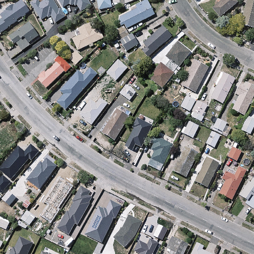
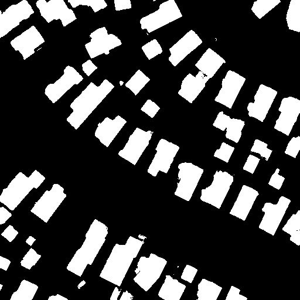
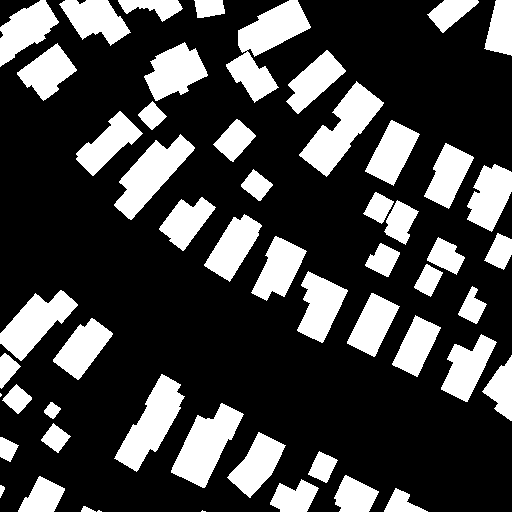

# U-Net for RGB Semantic Segmentation

## Introduction
More details of U-Net architecture can be found on [U-Net: Convolutional Networks for Biomedical Image Segmentation](http://lmb.informatik.uni-freiburg.de/people/ronneber/u-net/). The code was derived from [UNet](https://github.com/zhixuhao/unet) with additional supprt for RGB images.

## Dependencies
The following dependencies are needed:

* Numpy
* Tensorflow-gpu
* Keras
* Scikit-image

## Usage

1. Install dependencies:

```
conda env create -f env.yml
```

2. Configure paths and parameters with config.py
3. Train the model with train.py
4. Test the trained model with test.py

## Results


<p align="center">
  
</p>

<p align="center">
  
</p>

<p align="center">
  
</p>
